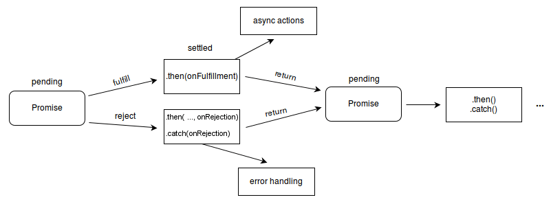
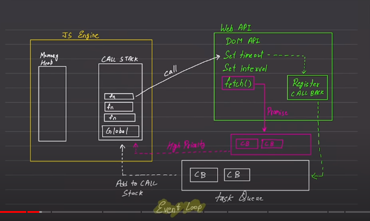

<!-- TOC -->

- [JavaScript](#javascript)
  - [How JavaScript works](#how-javascript-works)
    - [Execution Context : Component where JS is executed. It has](#execution-context--component-where-js-is-executed-it-has)
      - [Memory or variable Env -](#memory-or-variable-env--)
      - [Code Env or Thread of Execution -](#code-env-or-thread-of-execution--)
  - [Variables](#variables)
    - [Things to Keep in mind when naming a variable](#things-to-keep-in-mind-when-naming-a-variable)
      - [JavaScript datatype](#javascript-datatype)
  - [Use proper variable names](#use-proper-variable-names)
    - [variable scope->Understanding](#variable-scope-understanding)
    - [Data Conversion](#data-conversion)
    - [Data Types](#data-types)
    - [Conversion Operator](#conversion-operator)
    - [Comparision](#comparision)
    - [String](#string)
    - [Num and Math](#num-and-math)
    - [Date](#date)
    - [Data Type Summary](#data-type-summary)
  - [Array](#array)
    - [Array Methods](#array-methods)
      - [push](#push)
      - [pop()](#pop)
      - [unshift](#unshift)
      - [shift](#shift)
      - [includes](#includes)
      - [indexOf](#indexof)
      - [sort](#sort-)
      - [toString](#tostring)
      - [join](#join)
      - [slice](#slice-)
      - [splice](#splice)
      - [push and concat example](#push-and-concat-example)
      - [How to flat an array](#how-to-flat-an-array)
      - [How to check if array](#how-to-check-if-array)
      - [Converts String to array](#converts-string-to-array)
      - [Converts variables to array](#converts-variables-to-array)
    - [Objects](#objects)
  - [Functions](#functions)
    - [Arrow function](#arrow-function)
    - [JS Execution](#js-execution)
  - [Control Flow](#control-flow)
    - [if](#if)
      - [Multiple ways to write if conditions](#multiple-ways-to-write-if-conditions)
    - [switch](#switch)
    - [Truthy](#truthy)
  - [Loops in JavaScript](#loops-in-javascript)
    - [Different types of Loops supported in JavaScript](#different-types-of-loops-supported-in-javascript)
    - [Using For Loop](#using-for-loop)
      - [Output:](#output)
    - [Using ForEach](#using-foreach)
      - [Output:](#output-1)
    - [Using ForOff](#using-foroff)
      - [Output:](#output-2)
    - [Using while loop](#using-while-loop)
      - [Output:](#output-3)
    - [Using Do while loop](#using-do-while-loop)
      - [Output:](#output-4)
    - [Using Map](#using-map)
      - [Output:](#output-5)
      - [What is console.log](#what-is-consolelog)
  - [JavaScript Good Practice](#javascript-good-practice)
    - [What is block scope and functional scope](#what-is-block-scope-and-functional-scope)
    - [Why should not use `var`](#why-should-not-use-var)
    - [What is undefined in JavaScript](#what-is-undefined-in-javascript)
    - [set](#set)
    - [null](#null)
    - [map](#map)
    - [filter](#filter)
    - [loops](#loops)
    - [String](#string-1)
    - [BigInt](#bigint)
    - [Object](#object)
    - [Reflect](#reflect)
    - [scopes](#scopes)
    - [Symbol](#symbol)
    - [Boolean](#boolean)
    - [currying](#currying)
    - [closures](#closures)
  - [promise](#promise)
    - [A Promise is in one of these states:](#a-promise-is-in-one-of-these-states)
    - [API Request](#api-request)
    - [call stack](#call-stack)
    - [web APIs](#web-apis)
    - [undefined](#undefined)
    - [deep copy](#deep-copy)
    - [data types](#data-types-1)
    - [event loop](#event-loop)
  - [JavaScript is a](#javascript-is-a)
  - [Execution Context](#execution-context)
  - [Blocking Code](#blocking-code)
  - [Non Blocking Code](#non-blocking-code)
    - [statements](#statements)
    - [asynchrony](#asynchrony)
    - [async - await](#async---await)
    - [conditionals](#conditionals)
    - [map method](#map-method)
    - [shallow copy](#shallow-copy)
    - [destructuring](#destructuring)
      - [Object Destructuring](#object-destructuring)
      - [Array Destructuring](#array-destructuring)
      - [Rest Operator](#rest-operator)
      - [Spread Operator](#spread-operator)
    - [pure function](#pure-function)
    - [lexical scoping](#lexical-scoping)
    - [arrow function](#arrow-function-1)
    - [Check weather passed String is numeric or not](#check-weather-passed-string-is-numeric-or-not)
    - [string methods](#string-methods)
    - [named imports](#named-imports)
    - [default imports](#default-imports)
    - [reduce method](#reduce-method)
    - [handling events or event listener and event bubbling and event capturing](#handling-events-or-event-listener-and-event-bubbling-and-event-capturing)
    - [setTimeout and setInterval](#settimeout-and-setinterval)
    - [forEach method](#foreach-method)
    - [template literals](#template-literals)
    - [normal functions](#normal-functions)
    - [spread operators](#spread-operators)
    - [promise chaining](#promise-chaining)
    - [optional chaining](#optional-chaining)
    - [conditional operator](#conditional-operator)
    - [function expressions](#function-expressions)
    - [Random Number](#random-number)
      - [Math.random()](#mathrandom)
  - [Enum](#enum)
  - [nodemailer](#nodemailer)
    - [Send email through outlook using nodemailer](#send-email-through-outlook-using-nodemailer)
    - [Send email through gmail using nodemailer](#send-email-through-gmail-using-nodemailer)
    - [Send Email From Your App Without a Backend](#send-email-from-your-app-without-a-backend)
  - [Database Connection](#database-connection)
  - [PostGresSQLConnection](#postgressqlconnection)
    - [Install following package](#install-following-package)
    - [Create a JS file like queries.js and Add following import statement](#create-a-js-file-like-queriesjs-and-add-following-import-statement)
    - [Create Connection With PostGresSQL DB](#create-connection-with-postgressql-db)
    - [Get Data from postgres table](#get-data-from-postgres-table)
    - [Export above created function, so that you could import in other JS file](#export-above-created-function-so-that-you-could-import-in-other-js-file)
  - [Using Object Literals Instead of Switch Case](#using-object-literals-instead-of-switch-case)
    - [function to getMarkRange() using switch case](#function-to-getmarkrange-using-switch-case)
    - [function to getMarkRange() using Object literal](#function-to-getmarkrange-using-object-literal)
  - [rest syntax](#rest-syntax)
  - [Array Destructuring using rest syntax](#array-destructuring-using-rest-syntax)
  - [Receiving Data using rest syntax](#receiving-data-using-rest-syntax)
  - [Object Destructuring using rest syntax](#object-destructuring-using-rest-syntax)
  - [Spreading data](#spreading-data)
  - [Spreading into a function call turns Array elements into function call arguments](#spreading-into-a-function-call-turns-array-elements-into-function-call-arguments)
  - [Remote command execution via SSH using NodeJS](#remote-command-execution-via-ssh-using-nodejs)
    - [Create a Unique ID](#create-a-unique-id)
  - [Switch Case Statement Simplify using Object Literals](#switch-case-statement-simplify-using-object-literals)
    - [We can use an "Object Lookup Map" instead of a "switch" statement for a cleaner syntax. Above switch statement re-written in Object Lookup map format.](#we-can-use-an-object-lookup-map-instead-of-a-switch-statement-for-a-cleaner-syntax-above-switch-statement-re-written-in-object-lookup-map-format)
      > - [Mean ing of ^ and ~ symbols mentioned in the package.json file for the package version](#meaning-of--and--symbols-mentioned-in-the-packagejson-file-for-the-package-version)
  - [How To Create Express Server](#how-to-create-express-server)
  - [How To Create Server Using Express/NodeJS](#how-to-create-server-using-expressnodejs)
    - [Install following package](#install-following-package-1)
    - [Add following at start of file (create a JS file like index.js)](#add-following-at-start-of-file-create-a-js-file-like-indexjs)
    - [Open CMD prompt](#open-cmd-prompt)
  - [Fetch Data from API](#fetch-data-from-api)
  - [Different ways to fetch data from API](#different-ways-to-fetch-data-from-api)
    - [Create ENUM in JavaScript](#create-enum-in-javascript)
  - [Array method()](#array-method)
  - [Mutating Array methods](#mutating-array-methods)
    - [Mutating Array Methods list](#mutating-array-methods-list)
- [Array -> Filter() method](#array---filter-method)
  - [variable scope->Understanding](#variable-scope-understanding-1)
  - [Array -> map() method](#array---map-method)
  - [Array -> reduce() method](#array---reduce-method)
    - [Array -> Remove Duplicate Values](#array---remove-duplicate-values)
      - [remove duplicate Using Set](#remove-duplicate-using-set)
      - [remove duplicate Using Array reduce() method](#remove-duplicate-using-array-reduce-method)
      - [remove duplicate Using Array filter() method](#remove-duplicate-using-array-filter-method)
      - [Remove duplicates from an array of objects by one property](#remove-duplicates-from-an-array-of-objects-by-one-property)
      - [Remove duplicates from an array of objects by multiple properties](#remove-duplicates-from-an-array-of-objects-by-multiple-properties)
  - [How to make arrays mutable](#how-to-make-arrays-mutable)
    - [Array](#array-1)
  - [JavaScript Interview Question](#javascript-interview-question)
    - [What is JavaScript and what are its key features?](#what-is-javascript-and-what-are-its-key-features)
    - [What is the difference between null and undefined in JavaScript?](#what-is-the-difference-between-null-and-undefined-in-javascript)
    - [Explain the concept of closures in JavaScript and provide an example.](#explain-the-concept-of-closures-in-javascript-and-provide-an-example)
    - [What is the difference between let, const, and var in JavaScript for declaring variables?](#what-is-the-difference-between-let-const-and-var-in-javascript-for-declaring-variables)
    - [What is the Event Loop in JavaScript and how does it work?](#what-is-the-event-loop-in-javascript-and-how-does-it-work)
    - [How does prototypal inheritance work in JavaScript?](#how-does-prototypal-inheritance-work-in-javascript)
    - [Explain the concept of hoisting in JavaScript.](#explain-the-concept-of-hoisting-in-javascript)
    - [What are arrow functions in JavaScript? How do they differ from regular functions?](#what-are-arrow-functions-in-javascript-how-do-they-differ-from-regular-functions)
    - [What are Promises in JavaScript and how do they handle asynchronous operations?](#what-are-promises-in-javascript-and-how-do-they-handle-asynchronous-operations)
    - [How does the this keyword work in JavaScript? Provide examples of different contexts where this can be used.](#how-does-the-this-keyword-work-in-javascript-provide-examples-of-different-contexts-where-this-can-be-used)
    - [Explain the concept of event delegation in JavaScript.](#explain-the-concept-of-event-delegation-in-javascript)
    - [What is the purpose of using the bind, call, and apply methods in JavaScript?](#what-is-the-purpose-of-using-the-bind-call-and-apply-methods-in-javascript)
    - [What is the difference between synchronous and asynchronous JavaScript?](#what-is-the-difference-between-synchronous-and-asynchronous-javascript)
    - [How to explain Event loop and async js](#how-to-explain-event-loop-and-async-js)
    - [How to explain Hoisting and temporal dead zone](#how-to-explain-hoisting-and-temporal-dead-zone)
    - [How to explain scope and scope chain](#how-to-explain-scope-and-scope-chain)
    - [How to explain prototypal inheritance and chaining](#how-to-explain-prototypal-inheritance-and-chaining)
    - [How to explain promises and queues](#how-to-explain-promises-and-queues)
    - [How to explain async await in interviews](#how-to-explain-async-await-in-interviews)
    - [How to answer closure and lexical scoping](#how-to-answer-closure-and-lexical-scoping)
    - [How to answer THIS in interviews](#how-to-answer-this-in-interviews)
    - [How to explain call bind and apply in interviews](#how-to-explain-call-bind-and-apply-in-interviews)
  - [Coding Problem Using JavaScript](#coding-problem-using-javascript)
    - [Reverse a String](#reverse-a-string)
    - [Sum of array elements](#sum-of-array-elements)
    - [Largest/Smallest number in array](#largestsmallest-number-in-array)
    - [Remove duplicates from an array](#remove-duplicates-from-an-array)
    - [Remove All Whitespace from a String in JavaScript](#remove-all-whitespace-from-a-string-in-javascript)
    - [If you want to get the text that a user selects or highlights on a web page, there is a useful one-liner for that](#if-you-want-to-get-the-text-that-a-user-selects-or-highlights-on-a-web-page-there-is-a-useful-one-liner-for-that)
    - [There is a method called scrollTo(x,y), it allows you to scroll to a particular set of used coordinates](#there-is-a-method-called-scrolltoxy-it-allows-you-to-scroll-to-a-particular-set-of-used-coordinates)
    - [If you want to have a smooth scrolling animation](#if-you-want-to-have-a-smooth-scrolling-animation)
    - [If you want to redirect the user to a specified location, you can do something like this](#if-you-want-to-redirect-the-user-to-a-specified-location-you-can-do-something-like-this)
    - [JS Common Interview Questions](#js-common-interview-questions)
      > - [Read JSON File in JavaScript](#read-json-file-in-javascript)
    - [Data Structure Introduction](#data-structure-introduction)
      - [map](#map-1)
      - [set](#set-1)
      - [Stack](#stack)
      - [Queue](#queue)
      - [Linked List](#linked-list)
      - [Binary Trees](#binary-trees)
      - [Recursion](#recursion)
      - [Graph](#graph)
      - [Dynamic Programming](#dynamic-programming)
      - [Amortized space time complexity practice](#amortized-space-time-complexity-practice)
    - [Sorting Algorithm](#sorting-algorithm)
      - [Bubble sort](#bubble-sort)
      - [Insertion sort](#insertion-sort)
      - [Merge Sort](#merge-sort)
      - [Quick Sort](#quick-sort)
      - [Selection Sort](#selection-sort)
  - [class and OOPs](#class-and-oops)
    - [OOPs](#oops)
    - [Object](#object-1)
    - [Why use OOP](#why-use-oop)
    - [parts of OOP](#parts-of-oop)
    - [Object literal](#object-literal)
    - [Prototype](#prototype)
    - [4 pillars](#4-pillars)
  - [DOM](#dom)
  <!-- TOC -->

# JavaScript

## How JavaScript works

Everything in JS happens inside an Execution context. it is a synchronous single-threaded language.

#### Execution Context : Component where JS is executed. It has

##### Memory or variable Env -

    Here variables are stored as`key:value` pair

##### Code Env or Thread of Execution -

    This is the place where code is executed one line at a time

## Variables

### Things to Keep in mind when naming a variable

- `Names should be self descriptive with enough context so we don't have to comment out code`
- `Descriptive names are better than comments`
- `Avoid single letter names`
- `prefer explicit over implicit names`
- `Use descriptive loop indexes instead of i, j, k`
- `Avoid double negatives`
- `Use verb as a prefix for the function name`
- `No magic number or magic values, use a variable`
- `Don't use abbreviations or acronyms without sufficient contexts`
- `Make variable name as long as necessary if needed but no longer`
- `A prefix like is, are , or has helps to distinguish a boolean from another variable`

#### JavaScript datatype

"use strict" //treat all JS code as newer version in whole file

// alert(3+3) // cant use in nodejs, can be used browser. Currently, we are running in nodejs let name = "Abhay" //String data types let age =18 // number data types let isLoggedIn = false //boolean data types -- true/false let ab = null // it is a standalone value, its a type. repretensation of empty value let abc = undefined // when value is not defined or assigned // symbol - used to uniquely define a component

// object

console.log(typeof undefined); //undefined reason value not assigned console.log(typeof null); //is a type

## Use proper variable names

- Use the specific naming convention, can use camel case naming convention

### variable scope->Understanding

/_ Declaring a variable in the global scope. its life span is whole program _/

```
var globalScopeVariable = 7;

function test() {
  /* Declaring a variable in the function scope. It's life span is in function only*/
  var functionScopeVariable = 10;

  /* Declaring a variable in the local scope, inside a for loop. It's life span is inside for loop only */
  for (let index = 0; index < functionScopeVariable; index++) {
    console.log(index);
  }
}

test();


 `console.log(functionScopeVariable); //will throw error - ReferenceError: functionScopeVariable is not defined. Reason we are trying to use this outside of function scope`
```

```
const accountId = 14456;
let accountEmail = "abhay@gmail.com"
var accountPassword = "12345"
accountCity = "Bangalore"
// accountId =2; //not allowed
accountEmail ="hc@gmail.com"
accountPassword = "212121"
accountCity = "Delhi"
console.log(accountId);

let accountState;

console.table([accountId,accountEmail,accountPassword,accountCity,accountState])`
```

** Prefer not to use var because of issue in block scope and functional scope**

`console.log('accountState',accountState);`

### Data Conversion

```
let score = true;

let valueInNumber = Number (score);
console.log(score);
console.log(typeof valueInNumber);
console.log(valueInNumber);`
```

**Outcome**:

1. if score = 33, output will be number & 33
2. if score= "33" output will be number & 33
3. if score = "33abc" output will be number & NaN
4. if score = null output will be number & 0
5. if score = undefined output will be number & NaN
6. if score = true output will be number & 1

**Boolean conversion** Boolean(score); 1 => true; 0 => false "" => false "abhay" => true

`To Do` : All possible Data Type Conversion

### Data Types

**"use strict"** //treat all JS code as newer version in whole file

```
// alert(3+3) // cant use in nodejs, can be used browser. Currently, we are running in nodejs
//JavaScript : 7 Primitive Data types
// 1. String
let name = "Abhay" //String data types

// 2. number
let age =18 // number data types

// 3. BigInt

// 4. Boolean
let isLoggedIn = false //boolean data types -- true/false

// 5. undefined
let abc = undefined // when value is not defined or assigned

// 6. null
let ab = null // it is a standalone value, its a type. repretensation of empty value
// 7. symbol
```

//Object Data Type // 1. An Object // 2. An Array // 3. A date

// symbol - used to uniquley define a component

### Conversion Operator

let score = "abh"; console.log(typeof score); console.log(typeof(score)); let valueInNumber = Number(score) // console.log(typeof valueInNumber); // console.log(typeof(valueInNumber)); // console.log(valueInNumber);

//"33" => 33 can be converted easily //"33abc" => NaN (Not a number), typeof returns number for this //true => 1; false =>0

let isLoggedIn = "Abhay"; let booleanIsLoggedIn = Boolean(isLoggedIn) // console.log(booleanIsLoggedIn); // console.log(typeof booleanIsLoggedIn);

//1 in Boolean is => true //0 in Boolean is => false //"Abhay" in Boolean is => true

let someNumber = 33; let stringNumber = String(someNumber) // console.log(stringNumber); // console.log(typeof stringNumber);

//**\*\*\*\***Operations \***\*\*\*\*\*\*\*** let value =3; let negValue = -value; // console.log(negValue);

let str1 ="1" let str2 = 2 console.log("1"+2); console.log(1+"2"); console.log("1"+2+2); console.log(1+2+"2"); console.log(+true); //senseless code console.log(+""); //senseless code

let num1, num2, num3; num1 = num2=num3 = 2+2; //not a good way to write code, foremost focus should be on readability

let gameCounter = 100; ++gameCounter; console.log(++gameCounter); //prefix operator, increases value then print console.log(gameCounter++); //postfix operation, prints and then increases values // object

`typeof variable //will show type of variable console.log(typeof undefined); //undefined reason value not assigned, is a datatype console.log(typeof null); //object, null is an object`

### Comparision

//comparision of same data type is straight forward console.log(2>1); console.log(2 >=1);

//problem arises when you compare two different data types console.log("2">1); console.log("02">1); console.log("02">2); // always convert data into same data type

console.log("=====null comparision -- should avoid this type of conversion ======"); console.log(null >0); console.log(null === 0); console.log(null >=0); // The reason is that an equality check == and comparisions >< >= <= works differently. Comparisions convert null to a number, treating it as 0. Thats why null >=0 is true and null > 0 is false

console.log("=====undefined comparision -- should avoid this type of conversion ======"); console.log(undefined >0); console.log(undefined == 0); console.log(undefined >=0); // always returns false

//Query -> Comparision & Equality works differently // === checks strict comparision

### String

const name = "Abhay" const repoCount = 50; console.log(`Hello my name is ${name} and my repo count is ${repoCount}`); //this is called string interpolation, it allows to add methods like ${name.ToUppercase()}

const gameName = new String('Abhay Name'); //another way to declare string console.log(gameName); console.log(gameName[1]); console.log(gameName.**proto**); console.log(gameName.length); // get length of string value console.log(gameName.toUpperCase()); console.log(gameName.charAt(1)); console.log(gameName.indexOf('A')); console.log(gameName.substring(0,4)); console.log(gameName.slice(-3)); console.log(gameName.trim()); console.log(gameName.replace('A','T')); console.log(gameName.includes("Abhay")); console.log(gameName.split(" "));

//To Do - write a blog about string operation method

### Num and Math

const score = 400 const balance = new Number(100.05); // console.log(typeof score); // console.log(typeof balance); // console.log(score); // console.log(balance.toFixed(2)); const otherNumber = 1123.8966; // console.log(otherNumber.toPrecision(4)); const hundreds = 10000000 // console.log(hundreds.toLocaleString('en-IN')); //+++++++++++++++++ Maths ++++++++++++++++++ console.log(Math.abs(-4)); // minus value get converted to 4 (positive value) console.log(Math.round(4.6)); console.log(Math.ceil(4.2)); //take upper value console.log(Math.floor(4.9)); // take lower value

let ab =[9,3,7,8,4] console.log(Math.min(...ab)); // find lowest value console.log(ab.reduce((a,b)=>Math.min(a,b))); //find lowest value console.log(Math.random()); //return value between 0 & 1 console.log(Math.floor((Math.random()\*10)+1));

const min = 10; const max = 20; console.log(Math.floor(Math.random()\*(max-min+1))+10) // to get random value between min & max range

### Date

/\*JavaScript Date objects represent a single moment in time in a platform-independent format.

A JavaScript date is fundamentally specified as the time in milliseconds that has elapsed since the epoch, which is defined as the midnight at the beginning of January 1, 1970, UTC (equivalent to the UNIX epoch). This timestamp is timezone-agnostic and uniquely defines an instant in history.\*/

let myDate = new Date(); // console.log(myDate); // console.log(typeof myDate); // console.log(myDate.toString()); // console.log(myDate.toLocaleDateString());

let myCreatedDate = new Date(2023,0,23,5,3); console.log(myCreatedDate);

let myCreatedDate1 = new Date("2023-01-14"); //YYYY-MM-DD console.log(myCreatedDate1.toLocaleDateString());

let myTimeStamp = Date.now(); console.log(myTimeStamp);

let newDate = new Date(); console.log(newDate.getMonth()); console.log(newDate.getDay()); console.log(newDate.getFullYear());

console.log(newDate.toLocaleDateString("default",{weekday:"long",timezone:"Asia/Kolkata"}));

### Data Type Summary

//1. primitive (when passed, it is passed as value, no reference is provided) // 7 types //1.1 String //1.2 Number //1.3 Boolean //1.4 null //1.5 undefined //1.6 Symbol //1.7 BigInt (to handle scientific number value, const bigNumber = 12345677777788n)

//2. non-primitive or reference type (can direclty refer memory address) //2.1 Array const heroes = ["Shaktiman","naagraj"] //2.2 Objects (can have mixed data types) let myObj = { name:"Abhay", age:22, } //2.3 Functions const myFunc = function(){ console.log("hello world"); } console.log(typeof heroes);

//JavaScript is a dynamically typed language which means that data types of variable are determined by the value they hold at runtime and can change throughout the program as we assign different values to them.

//How to define Symbol const id = Symbol('123') const anotherId =Symbol('123')

console.log(id); console.log(id === anotherId); //value is same but returns false console.log(typeof id); //typeof results /\*1. undefined : "undefined"

2. Null : "object"
3. Boolean : "boolean"
4. Number : "number"
5. String : "string"
6. Object (native  
   and does implement [[calll]]) : "object"
7. Object (native  
   or host and does implement [[calll]]) :"object"
8. Object (or host  
   and does implement [[calll]]) : implementation defined except may not be "undefined", "boolean",  
   "number" or "String" \*/

//++++++++++++++++++Memory Types+++++++++++++++++++++++++ //1. Stack Memory // all primitive type uses, provides only value //2. Heap Memory // Non-Primitive types, provides referece

let ytName = "abhay"

## Array

The Array object, as with arrays in other programming languages, enables storing a collection of multiple items under a single variable name, and has members for performing common array operations.

arrays aren't primitives but are instead Array objects:

1. arrays are resizable and can contain a mix of different data types. (When those characteristics are undesirable, use typed arrays instead.)
2. arrays are not associative arrays and so, array elements cannot be accessed using arbitrary strings as indexes, but must be accessed using non-negative integers (or their respective string form) as indexes.
3. arrays are zero-indexed: the first element of an array is at index 0, the second is at index 1, and so on — and the last element is at the value of the array's length property minus 1.
4. array-copy operations create shallow copies. (All standard built-in copy operations with any JavaScript objects create shallow copies, rather than deep copies).

```
 //Declare an array
  const myArray = [1,2,3,4,true,"ABhay"];
  console.log(myArray);

  myArray[1] = 10 //valid operation although array is decalrad as const
  myArray = [2,3,4] //Invalid operation reason myArray is declared as const

  const myHeroes = new Array("C","A","B","D");
  console.log(myHeroes);

  let ab= [1,2,3,"B"];
  ab[1] = 5;
  ab = [4,5,7] //valid operation reason array is declareda let
  console.log(ab);
```

### Array Methods

#### push

This method adds element at the end of current array. It modifies the original array.

```
 ab.push("Dhruva");
 console.log(ab);
 //output : [ 1, 2, 'Dhurva' ]
```

#### pop()

This method removes last element from original array and returns value. It modifies the original array.

```
 ab.pop();
 let temp = ab.pop()
 console.log(ab); // [1,2]
 console.log(temo); //Dhruva
```

#### unshift

This method adds new element at the beginning of array

```
 ab.unshift("Start");
 console.log(ab); // [ 'A', 1, 2 ]
```

#### shift

This method removes first element from original array and returns value. It modifies the original array.

```
let temp = ab.shift();
console.log(ab); // [1,2]
console.log(ab); // A
```

#### includes

It checks for given value in array and returns true if element is found else false.

```
console.log(myHeroes.includes("A")); //returns true if element is found else false
marks.includes(120) //check if this value is in array
```

#### indexOf

It checks for given value in array and returns element index from array else -1 if element is not found.

```
let ab = ['B',1,2];
console.log(myHeroes.indexOf("B")); //index : 0
console.log(myHeroes.indexOf("3")); //index : -1

```

#### sort

This method sorts array values.

```
console.log('Sort array values : ',myHeroes.sort()); //sort array values
```

`Sort String Array`

```
let fruits = ["Banana","Apple"]
fruits.sort() //return sorted array
```

`Sort Number Array`

```
let fruits = [1,2,6,9,3,100,40] //return sorted array
```

> ![CAUTION] Sorting does not give correct result when array has number as well as string values.

#### toString

It is a generic method applicable to all objects and convert an object's value to string. The values are separated by commas.

```
let ab = ["ab","bc","da",10,5];
console.log('Convert array to String : ',myHeroes.toString()); //10,5, ab,bc,dc
```

#### join

join() method can only be used on array. It joins the array elements and returns a string. The values are seperated by the commas (by default), using `join()` method. We can also specify separator.

```
const newArra = ab.join();
console.log(newArra ); //10,5,ab,ca,da

const newArra = ab.join(|); //replace the default separator
console.log(newArra ); //10|5|ab|ca|da : converts array to pipe operarot seperator value, typeOf new Array is `string`
```

#### slice

slice() method returns selected elements in an array, as a new array. It selects from a given startNum, up to a(not inclusive) given end. It does not change the original method. We can use slice() method to create a new array from existing array and without impacting original array.

```
const myArray = [0,1,2,3,4,5,6];
const b = myArray.slice(1,3);
console.log("Orignal Array after slice : ",myArray); //original array after slice : [0,1,2,3,4,5,6] : no impact on original array
console.log('newArray' , b); // [1,3] : start from index : 1 and ends at 2 (not including index: 3)
```

#### splice

splice fetches elements from array, includes last range, also modifies original array. This can be used to cut number of elements from original array. We can use splice() method to create a new array from existing array and also remove the element in original array.

```
const myArray = [0,1,2,3,4,5,6];
const c = myArray.splice(1,3); //extract elements from index:1 to index:3
console.log("original array after splice : ",myArray); //[0,4,5,6] : left with rest of element
console.log('new Array : ',c); //new array : [1,2,3] from existing

`Break the array`
marks.slice(2,5)
```

#### push and concat operation on array

`Problem Description`: You have two arrays

```
const marvelHeroes = ["Thor", "IronMan"];
const marvelHeroes2 = ["Thor", "Zorawar"];
const DCHeroes = ["Spiderman","Batman"];
const DCHeroes2 = ["Spiderman","Batman"];
```

`Use Case 1 : ` Merge two arrays, no impact on original array

```
marvelHeroes.push(DCHeroes); // adds second array as child array, does not merge two array. modifies original array
console.log(marvelHeroes); //output : ['Thor', 'IronMan',['Spiderman','Batman']]
```

`Use Case 2 : ` Merge two arrays, no impact on original array

```
marvelHeroes.push(DCHeroes); // merge two array. modifies original array
console.log(marvelHeroes); //output : ['Thor', 'IronMan','Spiderman','Batman']
```

> [!CAUTION] concat() method is not much used, a better approach is using spread operator

```
const newArrayUsingSpread = [...marvelHeroes2,...DCHeroes2];
console.log("Merge Array Using Spread Operator : ",newArrayUsingSpread); //output : ['Thor', 'IronMan','Spiderman','Batman']
```

#### How to flat an array using flat()

Flattening an array is the process of taking nested array elements and basically putting them all into one "flat" array.

`Use Case 1` : flat() method flattens upto one level deep

```
const anArray = [1,2,3,[4,5,6],7,[6,7,[4,5]]];
const flatArray =anArray.flat(); // [1,2,3,4,5,6,7,6,7,[4,5]] : 2nd level nested array is not flatten
array
console.log("Flatten the array : ",flatArray);
```

`Use Case 2` : flat() method flattens upto any level of deep nesting using `infinity` keyword

```
const anArray = [1,2,3,[4,5,6],7,[6,7,[4,5]]];
const flatArray =anArray.flat(Infinity); // flatten the array till inifinite hierarchy or flatten the arrays into single
array
console.log("Flatten the array : ",flatArray); // [1,2,3,4,5,6,7,6,7,4,5]
```

#### How to check if array isArray()

`isArray()` method returns true if an object is an array otherwise false.

```
console.log("isArray : ",Array.isArray("AB"));
console.log("isArray : ",Array.isArray(flatArray));
```

#### Converts String to array using Array.from()

Array.from() method returns an array from an object with length property.

> [!CAUTION] If you use Array.from() on an array, will return `undefined`

```
console.log("Converts String to array : ",Array.from("ABC")); //Converts String to Array : ['A','B','C']
```

#### Converts variables to array

```
let s1 = 300;
let s2 = 400;
let s3 = 500;
console.log("Converts varaible to array : ",Array.of(s1,s2,s3));
```

### Mutating Array methods

Mutating array methods are one who mutate (Mutation is basically changing the array itself instead of returning a new array with the new changes) the original array right away, when executed.

It helps in following -

- `Avoid accidentally mutating : ` The original array should not be mutated right away
- `Do Easier mind map : `
- `These mutating methods need to be executed first`

#### Mutating Array Methods list

- `.copywithin() : ` use this to copy elements from within the array. It then replaces the pre-existing elements accordingly.
- .splice()
- .fill()
- .pop() - removes the last element from the array. This run on O(1) time .
- .push() - Adds elements to the end of array. This run on O(1) time .
- .reverse() -
- .sort()
- .unshift() - Adds element to the beginning of an array. This runs in O(n) time reason have to duplicate/move the entire array.
- .shift() - removes first element from the array. This runs in O(n) time reason have to duplicate/move the entire array.

```
//How to filter below array which has 'world' in it

/* Creating an array of strings. */
var wordsArray = [
  "hello-world",
  "hello1-world",
  "hello-we-world",
  "hello-hello",
  "jello-bello",
];


/* Filtering the array and returning the array which has the text "world" in it. */
var newArray = wordsArray.filter((wordHavingTextAsWorld) =>
  wordHavingTextAsWorld.includes("world")
);

//or with return statement
newArray = wordsArray.filter((wordHavingTextAsWorld) => {
  return wordHavingTextAsWorld.includes("world");
});

/* Printing the array which has the text "world" in it. */
console.log(newArray);


//Output ->
 //[ 'hello-world', 'hello1-world', 'hello-we-world' ]

```

### filter()

The `filter()` method is an iterative method. It calls a provided callbackFn function once for each element in an array, and constructs a new array of all the values for which callbackFn returns a truthy value. Array elements which do not pass the callbackFn test are not included in the new array.

```
const myNums = [1,2,3,4,5,6,7,8,9,10];
let newMyNums = myNums.filter((num)=>num<4) //you can write condition here. If condition is wrapped inside {}, return keyword needs to be provided
console.log(newMyNums);

newMyNumsTwo = myNums.filter((num)=>{return num<4})
console.log(newMyNumsTwo);
```

### Objects

//singleton -> constructor will create singleton object.

//Object literals -> when we create object using literals it will not be singleton const jsUser = { name:"Abhay", age: 18, "full name":"A B" }

console.log(jsUser.name); console.log(jsUser["name"]); console.log(jsUser["full name"]);

//Update value jsUser.name="Pari"; console.log(jsUser["name"]);

Object.freeze(jsUser); //You can freeze an object, once freezed, value can't be changed

jsUser["name"]="Shanvi"; console.log(jsUser["name"]);

//How to assign and access Symbol const mySymbol1 = Symbol("key1"); const jsUserWithSymbol = { name:"Abhay", [mySymbol1]:"key1", age: 18, "full name":"A B"  
} console.log(jsUserWithSymbol);

jsUserWithSymbol.greeting = function(){ console.log("Hello AB"); } console.log(jsUserWithSymbol.greeting());

jsUserWithSymbol.greeting2 = function(){ console.log(`Hello JS User , ${this.name}`); }

console.log(jsUserWithSymbol.greeting2());

const td = new Object(); //This is a singleton, object is same as created in 03_Objects.js file. Only difference is singleton console.log(td);

const regulatedUser = { email:"abc@hotmail.com", fullname:{ userfullName:{ "firstname":"Abhay", "secondname":"Bharti" } } }

// console.log(regulatedUser);

// console.log(regulatedUser.fullname.userfullName.firstname);

//Optional chaining -- The optional chaining (?.) operator accesses an object's property or calls a function. If the object accessed or function called using this operator is undefined or null, the expression short circuits and evaluates to undefined instead of throwing an error.

// console.log(regulatedUser?.fullname?.userfullName?.firstname);

const o1 = {1:"a",2:"b"}; const o2 = {3:"c",4:"d"};

const o3 = {o1,o2}; //This creates object inside object // console.log(o3);

//Object.Assign const o4 = Object.assign(o1,o2); //will merge two object and return a new object // console.log("Using Object.assign Operator : ",o4);

//Better way to do merge two object is spread opertor const o5 = {...o1,...o2}; // console.log("Using Spread Operator : ",o5);

// console.log(Object.keys(o1)); //returns key of object // console.log(Object.values(o1)); //retuns value of object // console.log(Object.entries(o1)); //retuns array of key/value pair

//hasOwnProperty method returns true if key exists else false // console.log(o1.hasOwnProperty('1')); //return true // console.log(o1.hasOwnProperty('A')); //return false

//Destructuring Of Objects

const course = { name:"Java", price: 400 }

//access value of an Object property using object name.property name console.log(course.price); const {price} = course; console.log("price : ",price); //access value after object destructuring const {name:n}=course; //can assign a new name at the time of destructuring console.log(n);

//Object desctructuring is useful when passing props to React component

//To Do How to Destrucutre An Array

## Functions

function hello(){ console.log("A"); }

// hello; //This return reference of a function, useful in React component // hello() //This statement executes a function

//check for undefined value using if operator function userName(name){ //Check for null and undefined if (name === undefined){ console.log("Enter a username"); return; } return `${name} just logged in` }

console.log(userName("Abhay")); console.log(userName());

// We can use logical Not (!) operator to check for null or undefined value function userName2(name){ //Check for null and undefined if (!name ){ console.log("Enter a username"); return; } return `${name} just logged in` }

console.log(userName2("Abhay")); console.log(userName2());

//To Do - Rest Operator function calculateCartPrice(...num){ return num; } console.log(calculateCartPrice(100,200,300)); //return an array as [100,200,300]

//Passing Object as a parameter in function

const aObject = { name:"Abhay", price: 299 }

function A(anObject){ console.log(`${anObject.name} and ${anObject.price}`); }

A(aObject);

//Passing array to functions function returnsSecondValueFromArray(getArray){ return getArray[1];  
}

const myArray = [3,4,6,8]; console.log("passing array as function : ",returnsSecondValueFromArray(myArray)); //pass array as parameters console.log("passing array directly as function : ",returnsSecondValueFromArray([8,9,10])); //passing arrays as directly as params

console.log(addOne(6));

//This approach of function declaration, you can call function execution statement before definition is written. This is called Hoisting. function addOne(num){ return num+1; }

console.log(addOne(5));

//In this approach, function execution statement should be after definition. Otherwise, will throw `Cannot access 'addTwo' before initialization` errror const addTwo = function (num){ return num+2; } console.log(addTwo(10));

### Arrow function

const user = { name:"AB", price:999, welcomeMessage:function(){ console.log(`${this.name}, welcome to Website`); //this contains all variable of object. } }

//Note : This context works only inside object, does not work in function. console.log(user.welcomeMessage()); user.name ="Ajay" //change value of name field console.log(user.welcomeMessage()); //print updated value

console.log("this in node : ",this); // {} - in node, this prints {}. If you print console.log(this) in chrome browser console, it will prints windows context

function hello(){ let name = "Abhay"; console.log("name : ",this.name); //prints undefined (behavior is same in arrow function) } hello()

//To Do - Why we need arrow function

//If function scope is added in arrow function like {}, means if curly braces is used, you need to use return keyword to return value from function. Otherwise function will not return any value const addTwo = (n1,n2) =>{ return n1+n2; } console.log("Explicit return ", addTwo(5,7));

//if written like below or like const addThree = (n1,n2,n3) => n1+n2+n3;, will automatically return value. No need to use return keyword. This is called implict arrow function. This is used a lot in ReactJS. const addThree = (n1,n2,n3) => (n1+n2+n3); console.log("Implicit return",addThree(5,7,2));

//Return Object from Arrow function const returnObjectFromArrowFunction = (n1,n2) => ({name:n1,age:n2}) //to return object, need to wrap object in () braces

console.log(returnObjectFromArrowFunction("AB",23));

//Immediately Invoked Function Expression (IIFE)

//name IIFE function (function chai(){ console.log('DB Connected'); })(); //This will get executed

// Notes : // 1. function definition should be wrapper in () // 2. () Should be appended at the end of first braces // 3. Should add ; at the end, to end context

//To Do - Why we need IIFE, practical need //This helps to avoid pollution due to global scope.

//unname IIFE function ( ()=>{ console.log('DB Connected using arrow function'); })(); //IIFE with arrow function

//unname IIFE function with params ( (name)=>{ console.log(`${name} DB Connected using arrow function`); })("AB"); //IIFE with arrow function

### JS Execution

//How code execute in JS (Execution Context) //Call Stack /_ Global Execution Context Function Execution Context Eval Execution Context _/

//Function code to be shown in execution context let v1 = 10; let v2 = 20; function add(v1,v2){ let total = v1+v2; return total; }

let result = add(v1,v2); let resultTwo = add(10,15);

/\* --- How JS Execution Happends ---

1. Global Execution or Environment -> this

2. Memory Phase -> all variables re put at a place v1 = undefined v2 = undefined add -> definition result = undefined resultTwo = undefined

3. Execution Phase v1 = 10 v2 = 20 add -> new Enviornment + new Execution Context/thread created (Step 1 t 3 will be repeated as many times function is called) \*/

//How to write code in Chrome browser // Sources -> Snippeets -> New Snippet -> file name -> write code in right side pane -> Crtl + S to save file

## Control Flow

### if

#### Multiple ways to write if conditions

**Classical approach**

```
const status = 'online'

if (status ==='online' || status === 'away' || status ==='busy'){
console.log('Do Something')
}
```

**A better approach**

`if (['online','away', 'busy'].indexOf(status)!== -1){ console.log('Do Something') }`

`Check IndexOf with `~` operator`

```

if (~['online','away', 'busy'].indexOf(status)){
 console.log('Do Something')
}
```

`Even better, using includes method`

```
if (['online','away', 'busy'].includes(status)){
 console.log('Do Something')
}
```

### switch

switch (key) { case value:

        break;

    default:
        break;

}

/\* #VSCODE tips to copy/paste/delete code using keyboard shortcut

1. Duplicate a Line/Code Block: place your cursor on a line or select a code block & press [Shift + Alt+ Down Arrow key]. Code will be duplicated.
2. Delete a Line/Code Block: place your cursor on a line or select a code block & press [Crtl + Shift + k]. Code will be removed.
3. Paste from history of all Copy/Cut items: There is no inbuilt feature available in #VSCODE. Here is a workaround, install extension #Clipboard Manager. This extension keeps history of copy/cut operation in VS Code. Press [Crtl + Shift + V], it will show history of values, you can select which one you want to paste. \*/

### Truthy

//Truthy/Falsy value const user = "ABC@ai"; if (user){ console.log(`Found user ${user}`); }else { console.log(`Not Found user `); // this will be printed if user = "" }

//falsy values List //false,0,-0,BigInt 0n,'', null,undefined, Nan

//truthy values List //"0",'false',' ',[],{},function()

//How to check truthy for array const userArray = []; if (userArray.length === 0){ //code to check for truthy value for array, is empty console.log("Array is empty"); }

//How to check truthy for array const emptyOb ={}; if (Object.keys(emptyOb).length ===0){ //get keys list & check if length is zero console.log("Object is empty"); }

false == 0 //true false == '' //true 0 == '' //true

//Nullish Coalescing Operator(??) //:null undefined - It assigns whatever first valid value is found

let val; val = null ?? 10; console.log(val); val = 5 ?? 10; console.log(val); val = undefined ?? 15; console.log(val);

val = undefined ?? null??20; console.log(val);

//Ternary Operator //test condition? true:false const price =100; price >=80?console.log("less than 80"):console.log('More than 80');

## Loops in JavaScript

const arr = [1,2,3,5,6]

//ForOF to iterate on an array for (const num of arr) { console.log(num); //print all values ofn an array }

const h = "hello"; for (const char of h) { console.log(char); //print all character of a string }

//JavaScript Map //To Do - What is Map const myMap = new Map(); myMap.set('A',1); myMap.set('B',3); myMap.set('C',5); console.log(myMap); //prints map -> Map(3) { 'A' => 1, 'B' => 3, 'C' => 5 }

//Iterater an Map & destructure array returned for each key/value pair, [key,val] is destructuring map key/value to key & val for (const [key,val] of myMap) { console.log(`key : ${key} -:- val : ${val}`); }

//Note : When we run a forof loop on Map, each element is returned as an array. We need to do it in two step, // 1. iterate through Map key/value pair using forof // 2. Desctructure each array (containing key/value pair) in two key & value // 3. Above approach can't be used on Object, forOf can't be used on Map // 4. for of loop is used on Array/Map

//How to iterate an Object const myObj = { k:"one", l:"two" } //We need ForIn to iteration over object & access value for (const key in myObj) { console.log(`key :  ${key} : value : ${myObj[key]}`); //print all values }

//Note : We can use ForIn on array, can't use on Map. Map is not an iterable.

//ForIn on array const anAray = [1,2,3,6]; for (const key in anAray) { console.log(anAray[key]); }

//ForEach Example const mArray = ["J", "k","L"]; //foreach with normal function mArray.forEach(function(item){ console.log(item); //print all values of array, we can write any logic code within cury{} braces })

//foreach with arrow function mArray.forEach((item)=>{ console.log(item); }) //Using external or another function

console.log("--------------"); function printMe(item){ console.log(item); }

mArray.forEach(printMe)

//foreach has access to item, index & full array mArray.forEach((item,index,arr)=>{ console.log(item,index,arr); })

//Array Of Objects

const mCode = [ {name:"JS",file:'.js'}, {name:"Java",file:'.java'}, {name:"python",file:'.py'} ]

mCode.forEach((item)=>{ console.log(item.name,item.file); })

//Notes - foreach does not return any value, better usable methods are filter/map/reduce

//How to return value using ForEach const myNums = [1,2,3,4,5,6,7,8,9,10]; const newNums = []; myNums.forEach((num)=>{ if (num > 4){ newNums.push(num) } }) console.log(newNums);

### Different types of Loops supported in JavaScript

**Here is sample array of objects**

```
const carShowRoom = [
  {id:1,name:'Maruti', model:"Swift"},
  {id:2,name:'Tata', model:"Nexon"},
  {id:3,name:'Mahindra', model:"Bolero"},
  {id:4,name:'Benz', model:"car"}
];
```

### Using For Loop

```
for (let index=0; index<carShowRoom.length;index++){
console.log(carShowRoom[index].name)
}
```

#### Output:

```
Maruti
Tata
Mahindra
Benz
```

### Using ForEach

```
carShowRoom.forEach(function(car, index, carShowRoom){
console.log(`Name: ${car.name} Model : ${car.model}`)
})
```

#### Output:

```
Name: Maruti Model : Swift
Name: Tata Model : Nexon
Name: Mahindra Model : Bolero
Name: Benz Model : car

```

### Using ForOff

```
for (let vehicle of carShowRoom){
  console.log(`Name: ${vehicle.name} Model : ${vehicle.model}`)
}
```

#### Output:

```
Name: Maruti Model : Swift
Name: Tata Model : Nexon
Name: Mahindra Model : Bolero
Name: Benz Model : car
```

### Using while loop

```
let index =0;
while(index<carShowRoom.length){
  console.log(carShowRoom[index].name)
  index++;
}
```

#### Output:

```
Maruti
Tata
Mahindra
Benz
```

### Using Do while loop

```
let index =0;
do {
  console.log(carShowRoom[index].name)
  index++;
}while(index<carShowRoom.length)
```

#### Output:

```
Maruti
Tata
Mahindra
Benz
```

### Using Map

```
let car = carShowRoom.map(carShowRoom => carShowRoom.name);
console.log(car)
```

#### Output:

```
[ 'Maruti', 'Tata', 'Mahindra', 'Benz' ]
```

#### What is console.log

whatever is given to console.log, should get displayed as output.

print multiple values in table console.table([accountId,accountEmail,accountPassword,accountCity])

## JavaScript Good Practice

👉Use Strict Mode: Always enable strict mode at the top of your scripts or functions. It helps catch common coding mistakes and prevents the use of potentially problematic features.

👉Declare Variables Properly: Always use `let`, `const`, or `var` to declare variables. Avoid relying on implicit global variables.

👉Avoid Global Variables:Minimize the use of global variables to prevent unintended interactions between different parts of your code.

👉Use Descriptive Variable and Function Names: Choose meaningful names for variables and functions. This improves code readability and makes it easier to understand your code's purpose.

👉Comment Your Code: Add comments to explain complex sections of your code, especially if it's not immediately obvious what the code does.

👉Indentation and Formatting: Maintain consistent indentation and formatting. This makes your code easier to read and reduces the risk of syntax errors.

👉Avoid Magic Numbers and Strings: Replace magic numbers and strings with named constants or variables to make your code more maintainable.

👉Error Handling: Implement proper error handling using `try...catch` blocks to gracefully handle exceptions and prevent crashes.

👉Use Functions for Code Reusability: Write functions to encapsulate and reuse code. Avoid duplicating code blocks.

👉Check Types and Use Type Coercion Wisely: Be aware of JavaScript's type system, and use `typeof`, `instanceof`, or functions like `isNaN()` to validate data types before operations.

👉Avoid Asynchronous Callback Hell: Use promises, async/await, or libraries like `async.js` to manage asynchronous code and avoid deeply nested callback structures.

👉Test Your Code: Implement unit tests and automated testing frameworks like Jest to catch bugs early and ensure your code behaves as expected.

👉Code Reviews: Encourage code reviews within your team. Fresh perspectives can help identify potential issues.

👉Use a Linter: Employ a JavaScript linter like ESLint to enforce coding standards and catch common mistakes.

👉Keep Dependencies Updated: Regularly update your project's dependencies to patch security vulnerabilities and ensure compatibility.

👉Optimize for Performance: Be mindful of performance bottlenecks and optimize critical sections of your code when necessary.

#### What is block scope and functional scope

#### Why should not use `var`

Prefer not to use `var` because of issue in block scope and functional scope

#### What is undefined in JavaScript

When you declare a variable & do not assign any value to it, it is undefined. ex.

```
let accountState;
console.log(accountState);
```

`undefined` is the output of above code

//TO Read https://www.linkedin.com/posts/saboor-malik-993b03202_75-useful-javascript-code-snippets-activity-7106737879598440448-gEWg?utm_source=share&utm_medium=member_desktop

### set

### null

### map

//map -- The map() method of Array instances creates a new array populated with the results of calling a provided function on every element in the calling array.

```
const myNums = [1,2,3,4,5,6,7,8,9,10];
let newNums = myNums.map((num)=>num+10) //will iterate all element & add value 10
console.log(newNums);
```

//To Do -- difference between filter and amp

// Note - map should be preferred instead of foreach if ask is to iterate all element & perform some operation

//function Chaining

```
const m = myNums.map((num)=>num*10).map((num)=>num+1).filter((num)=>num>40);
console.log(m);
```

### loops

### String

### BigInt

### Object

### Reflect

### scopes

### Symbol

### Boolean

### currying

### closures

```
<!DOCTYPE html>
<html lang="en">
  <head>
    <meta charset="UTF-8" />
    <meta name="viewport" content="width=device-width, initial-scale=1.0" />
    <title>Closure</title>
  </head>
  <body>
    <button id="orange">Orange</button>
    <button id="green">Green</button>
  </body>
  <script>
    function outer() {
      let name = "Mozilla"; //name is a local variable created by init
      function inner() {
        //inner() is the inner function, that forms the closure
        console.log("Inner function", name); //use variable declared in the parent function
        let secret = "my123"; // this will be accessible only inside this method
      }
      function innerTwo() {
        //inner() is the inner function, that forms the closure
        console.log("InnerTwo function", name); //use variable declared in the parent function
      }
      return inner; //when you return reference of inner function, it sends inner function reference + lexical scope of outer function
      inner();
      innerTwo();
    }
    outer();
    //console.log("Too Outer",name); // will throw error, not available in outer context
  </script>

  <script>
    //closure practical or real world example

    function clickHandler(color) {
      console.log(color);
      return function () {
        console.log(`innerfunction ${color}`);
        document.body.style.backgroundColor = `${color}`;
      };
    }
    document.getElementById("orange").onclick = clickHandler("orange");
    document.getElementById("green").onclick = clickHandler("green");
  </script>
</html>
```

## promise

The Promise object represents the eventual completion (or failure) of an asynchronous operation and its resulting value.

### A Promise is in one of these states:

`pending`: initial state, neither fulfilled nor rejected.

`fulfilled`: meaning that the operation was completed successfully.

`rejected`: meaning that the operation failed.



https://www.youtube.com/watch?v=_TjtAyMkiTI promises starts at 5:39

### API Request

```
<!-- Notes - What is API, Hit api using XHR  -->
<!DOCTYPE html>
<html lang="en">
  <head>
    <meta charset="UTF-8" />
    <meta name="viewport" content="width=device-width, initial-scale=1.0" />
    <title>Document</title>
  </head>
  <body style="background-color: #212121">
    <!--
    0. UNSENT client has been created. open() not called yet
    1. OPENED open() has been called
    2. HEADERS_RECEIVED send() has been called, and headers and
    status are available
    3. LOADING Downloading; responseText holds partial data.
    4. DONE The operation is complete. -->
    <button id="showcard">Show Card</button>
    <div id="showdetails"></div>
  </body>
  <script>
    let followersCount;
    let profileImage;
    let followerSpan;
    let imageTag;
    const getData = document.querySelector("#showcard");
    const showDetails = document.querySelector("#showdetails");
    getData.addEventListener("click", () => {
      getGitHubProfileData();
    });

    function getGitHubProfileData() {
      const requestUrl = "https://api.github.com/users/abhaybharti";
      const xhr = new XMLHttpRequest();
      xhr.open("GET", requestUrl);
      xhr.onreadystatechange = function () {
        console.log("xhr.readyState", xhr.readyState);
        if (xhr.readyState === 4) {
          //console.log("xhr.responseText", this.responseText);
          const data = JSON.parse(this.responseText);
          followersCount = data.followers;

          if (document.getElementsByTagName("p").length > 0) {
            document.getElementsByTagName("p")[0].innerHTML = followersCount;
          } else {
            followerSpan = document.createElement("p");
            showDetails.appendChild(followerSpan);
            followerSpan.innerHTML = followersCount;
          }

          if (document.getElementsByTagName("img").length > 0) {
            profileImage = data.avatar_url;
            imageTag.setAttribute("src", profileImage);
          } else {
            profileImage = data.avatar_url;
            imageTag = document.createElement("img");
            imageTag.setAttribute("src", profileImage);
            showDetails.appendChild(imageTag);
          }
        }
      };
      console.log("xhr.readyState outside", xhr.readyState);
      xhr.send();
    }
  </script>
</html>

```

```
const promiseOne = new Promise(function (resolve, reject) {
//Do an async task
//DB calls, cryptography, network
setTimeout(function () {
console.log("Async task is completed");
resolve();
}, 1000);
});

promiseOne.then(function () {
console.log("Promise consumed");
});

//2nd promise
new Promise(function (resolve, reject) {
setTimeout(function () {
console.log("Async task 2");
resolve();
}, 1000);
}).then(function () {
console.log("Async 2 resolved");
});

//3rd promise -- pass data through resolve
const promiseThree = new Promise(function (resolve, reject) {
setTimeout(function () {
resolve({ username: "chai", email: "chai@gmail.com" });
}, 1000);
});

promiseThree.then(function (user) {
console.log(user);
});

//4th Promise

const promiseFour = new Promise(function (resolve, reject) {
setTimeout(function () {
let error = true;
if (!error) {
resolve({ username: "hitesh", email: "123" });
} else {
reject("ERROR: Something went wrong");
}
}, 1000);
});

promiseFour
.then((user) => {
console.log(user);
return user.username;
})
.then((username) => {
console.log(username);
})
.catch((error) => {
console.log(error);
})
.finally(() => {
console.log("Finally block -- THe promise is finally resolved or rejected");
});

//promise 5
const promiseFive = new Promise((resolve, reject) => {
setTimeout(() => {
let error = true;
if (!error) {
resolve({ username: "javascript", email: "123" });
} else {
reject("ERROR: JS went wrong");
}
}, 1000);
});

async function consumePromiseFive() {
try {
const response = await promiseFive;
console.log(response);
} catch (error) {
console.log(error);
}
}

consumePromiseFive();

//promise 6
async function getAllUsers() {
try {
const response = await fetch("https://jsonplaceholder.typicode.com/users");
//console.log(response);
const data = await response.json();
console.log(data);
} catch (error) {
console.log("E:", error);
}
}
getAllUsers();

console.log("----------------------------------");
// fetch with then/catch
fetch("https://api.github.com/users/abhaybharti")
.then((response) => {
return response.json();
})
.then((data) => {
console.log(data);
})
.catch((error) => {
console.log(error);
});

//To Do - read more about fetch api
// Micro task queue or priority queue  contains fetch request. It gets added on top of call stack.

```

### call stack

### web APIs

### undefined

### deep copy

### data types

### event loop

## JavaScript is a

- synchronous language (every thing happens in sequence)
- Single threaded

## Execution Context

- execute one line of code at a Time (each operation waits for the last one to complete before executing next line)
- console.log("hello") -- 1
- console.log("hello") -- 2 Call Stack Memory Heap

//Above is behavior of default engine of JavaScript

## Blocking Code

- Block the flow of program
- Read file sync

## Non Blocking Code

- Does not load block execution
- Read file Async

This diagram is explained at time stamp 4:10 in video https://www.youtube.com/watch?v=_TjtAyMkiTI



JavaScript engine is made up of Call stack & Memory Heap.

Task Queue in JS Engine in Event loop

```
<!DOCTYPE html>
<html lang="en">
  <head>
    <meta charset="UTF-8" />
    <meta name="viewport" content="width=device-width, initial-scale=1.0" />
    <title>HTML Events</title>
  </head>
  <body style="background-color: #414141; color: aliceblue">
    <h2>Amazing Image</h2>
    <div>
      <ul id="images">
        <li>
          
        </li>
        <li>
          
        </li>
        <li>
          
        </li>
        <li>
          
        </li>
        <li>
          
        </li>
        <li>
          <a style="color: aliceblue" href="https://google.com" id="google"
            >Google</a
          >
        </li>
      </ul>
    </div>
  </body>
  <script>
    const owl = document.querySelector("#owl");
    //Note - addEventListener - takes 3 arguments, 1. event name 2. action on event, 3. true/false - false is default value
    //Note - read more about events on javascript events mdn
    //type, timestamp, defaultPrevented, target, toElement, srcElement, currentTarget, clientX, clientY,screenX, screenY, altKey,ctrlKey,shiftKey,keyCode
    // owl.addEventListener(
    //   "click",
    //   (event) => {
    //     console.log(event);
    //     console.log("owl clicked");
    //     event.stopPropagation(); // This stops event to be sent to parent element
    //   },
    //   false
    // );

    document.querySelector("#images").addEventListener(
      "click",
      (event) => {
        console.log("clicked inside the ul");
      },
      false
    );

    //Note - What is propagation
    //Event Bubbling : gets triggered when false is passed as 3rd argument. first child (owl) element click will be run, then parent element click event will be run. event.stopPropagation() is called to stop parent element click event to be triggered, only child element click event will be triggered.
    //Event Capturing: gets triggered when true is passed as third paramter. Parent element event will be executed first, child element event will be run 2nd.

    //Note - event.preventDefault(); disable default behavior like click on google is not loading new url
    document.querySelector("#google").addEventListener(
      "click",
      (event) => {
        console.log("Google clicked");
        event.preventDefault();
        event.stopPropagation(); // stop event bubbling means image element (parent element) click event will not be triggered
      },
      false
    );

    document.querySelector("#images").addEventListener(
      "click",
      (event) => {
        console.log(event.target.parentNode);
        console.log(event.target.tagName);
        //remove element if user clicks on Image. if user clicks on other element, do not remove
        if (event.target.tagName === "IMG") {
          console.log(event.target.id);
          let removeIt = event.target.parentNode;
          removeIt.remove(); //remove child directly
          //removeIt.parentNode.removeChild(removeIt); //go to parent node and remove child
        }
      },
      false
    );
  </script>
</html>

```

```
<!DOCTYPE html>
<html lang="en">
  <head>
    <meta charset="UTF-8" />
    <meta name="viewport" content="width=device-width, initial-scale=1.0" />
    <title>Document</title>
  </head>
  <body>
    <h1>Chai aur JavaScript</h1>
    <button id="stop">Stop</button>
    <button id="start">Start</button>
  </body>
  <script>
    const sayDate = function (str) {
      console.log(str, Date.now());
    };

    let intervalId;

    document.querySelector("#start").addEventListener("click", () => {
      console.log("printing started");
      intervalId = setInterval(sayDate, 1000, "hi");
    });

    document.querySelector("#stop").addEventListener("click", () => {
      console.log("printing stopped");
      clearInterval(intervalId);
    });
  </script>
</html>

```

```
<!DOCTYPE html>
<html lang="en">
  <head>
    <meta charset="UTF-8" />
    <meta name="viewport" content="width=device-width, initial-scale=1.0" />
    <title>Document</title>
  </head>
  <body>
    <h1>Chai aur Code</h1>
    <button id="stop">Stop</button>
  </body>
  <script>
    const sayHi = function () {
      console.log("Best JS Series");
    };

    const changeText = function () {
      document.querySelector("h1").innerHTML = "Best JS Series";
    };

    setTimeout(sayHi, 2000);
    //setTimeout, setInterval are not JavaScript core function, they are part of browser API
    const changeMe = setTimeout(changeText, 2000);

    //setTimeout takes two things, 1. handler (a function without name) 2. time in milliseconds. It runs only one time.
    // setTimeout(function () {
    //   console.log("Hitesh");
    // }, 1000);

    //setInterval takes two things, 1. handler (a function without name) 2. time in milliseconds. It runs at the interval of given time.
    // setInterval(function () {
    //   console.log("Hitesh");
    // }, 1000);

    //handle is a function which has no name.

    //clearTimeout() -- take reference of setTimeOut() function. It stops execution of setTimeOut() function
    //Stop timeout  using clearTimeout
    document.querySelector("#stop").addEventListener("click", () => {
      console.log("changeMe");
      clearTimeout(changeMe);
    });
  </script>
</html>

```

### statements

### asynchrony

### async - await

### conditionals

### map method

### shallow copy

### destructuring

#### Object Destructuring

#### Array Destructuring

#### Rest Operator

#### Spread Operator

### pure function

### lexical scoping

### arrow function

### Check weather passed String is numeric or not

````function
  return /^-?\d*\.?\d+$/.test(value);
}```

```function isNumeric(value) {
  return !isNaN(Number(value));
}
````

### string methods

### named imports

### default imports

### reduce method

//reduce -- To Do -- read more on reduce function //reduce is used frequently in react

```
const m =[1,3,4];
let initialVal = 0;
let newM = m.reduce((accumulate,currVal)=>{
console.log(`accumulate : ${accumulate} :  currVal : ${currVal}`);
return accumulate+currVal;
},initialVal)

console.log(newM);

//count total price in shoppingCart
const shoppingCart = [
{
courese: "JS",
price: 100
},
{
courese: "React",
price: 200
},
{
courese: "Redux",
price: 300
}
]

let totalPrice = shoppingCart.reduce((total,item)=>{
return total+item.price
},0)
console.log(totalPrice);
```

### handling events or event listener and event bubbling and event capturing

### setTimeout and setInterval

### forEach method

### template literals

### normal functions

### spread operators

### promise chaining

### optional chaining

### conditional operator

### function expressions

### Random Number

`True Random Number`: are generated based on external factors e.g. generating randomness using surroundings noise. It is time consuming to generate. `Pseudo Random Number`: are generated based on an algorithm and seed value. can be used in cryptography e.g. OTP

#### Math.random()

returns a double type pseudo-random number, greater than or equal to zero and less than one.

`let num = Math.random() -- return number between 0 and 1, every execution will generate new number`

## Enum

## nodemailer

### Send email through outlook using nodemailer

### Send email through gmail using nodemailer

### Send Email From Your App Without a Backend

https://www.abstractapi.com/guides/react-send-email-from-your-app-without-a-backend

## Database Connection

## PostGresSQLConnection

### Install following package

```
    "pg": "^8.8.0",
```

### Create a JS file like queries.js and Add following import statement

```
const { response, request } = require("express");
require("log-timestamp");
const Pool = require("pg").Pool;
var types = require("pg").types;
const ping = require("ping");
const { deviceDetails } = require("./DeviceList");
//var Ping = require("ping-lite");
const momenttimezone = require("moment-timezone");
```

### Create Connection With PostGresSQL DB

```
const pool = new Pool({
  user: "testloguser", //login user
  host: "localhost",
  database: "testlog", //database name
  password: "testloguser", // password
  port: 5432,//port where postgres is running
});
```

### Get Data from postgres table

```
const getDefectList = (request, response) => {
  try {
    let queryString ="select * from defects"; //make sure defects table exists in your database
    pool.query(queryString, (error, results) => {
      if (error) {
        throw error;
      }
      response.status(200).json(results.rows);
    });
  } catch (error) {
    console.log(error);
  }
};
```

### Export above created function, so that you could import in other JS file

```
module.exports = {
  getDefectList
};
```

## Using Object Literals Instead of Switch Case

#### function to getMarkRange() using switch case

```
function getMarkRange(grade) {
let range;
//Checking the value of the grade variable and returning the range of the grade using Switch case
switch (grade) {
case "A":
range = "100-70";
break;
case "B":
range = "40-69";
break;
case "C":
range = "0-39";
break;
}
return `range is ${range}`;
}
console.log(getMarkRange("B"));
```

#### function to getMarkRange() using Object literal

```
function getMarkRangeWithObjectLiteral(grade) {
let range = {
A: "100-70",
B: "40-69",
C: "0-39",
}[grade];
return `range is ${range}`;
}

console.log(getMarkRange("B"));
```

## rest syntax

## Array Destructuring using rest syntax

Array destructuring is flexible. It uses less space, and even allows you to ignore values. You can even get the remaining elements as a new array. Instead of accessing elements individually, one by one, you can get multiple at once.

```
const kidsName = ["Govind","Gopal","Pari","Kanhu","Aayu"]

//traditional way of accessing array values
const firstValue = kidsName[0];
const secondValue = kidsName[1];
console.log(firstValue);
console.log(secondValue);
```

```
const [firstValue, ,thirdValue, ...rest] = kidsName

console.log(firstValue);
console.log(thirdValue);
console.log(rest);
```

`Output:` Govind Pari [ 'Kanhu', 'Aayu' ]

## Receiving Data using rest syntax

A rest parameter is a special kind of parameter that receives all remaining arguments of a function call via array.

```
function myFunc(first, ...remaining) {
  return {first, remaining}
}

console.log(myFunc(1,2,3))
```

`Output:` { first: 1, remaining: [ 2, 3 ] }

## Object Destructuring using rest syntax

```
const {first:f, ...remaining} = {first:'Kanhu', last:'Pari', age:5}

console.log(f)
console.log(remaining)
```

`Output:` Kanhu { last: 'Pari', age: 5 }

## Spreading data

## Spreading into a function call turns Array elements into function call arguments

```
function returnArgArray(...args){
  return args
}

returnArgArray(...[1,2,3])

console.log(returnArgArray(...[1,2,3]))
`Output:`
[ 1, 2, 3 ]

//spread arrays into Array literals
console.log(returnArgArray(...[1,2,3],4))
`Output:`
[ 1, 2, 3, 4 ]
```

## Remote command execution via SSH using NodeJS

- 1st step, install `npm install --save simple-ssh`

```
const SSH = require('simple-ssh'); //load into project

//create instance of SSH
var ssh = new SSH({
    host: 'IP_ADDRESS',
    user: 'USERNAME',
    pass: 'PASSWORD'
});

//Run any command via exec command
ssh.exec(CMD, {
    out: function (stdout) { console.log(stdout); },
    err: function (stderr) { console.log(stderr); },
    exit: function (code) { console.log(code); }
}).start();
```

//Run actual command like this ssh .exec("online", { out: function (stdout) { console.log(stdout); }, err: function (stderr) { console.log(stderr); }, exit: function (code) { console.log(code); }, }) .start();

### Create a Unique ID

```
const uid = () =>{
  //Get current time and convert to String, String(36) converts large number to base 36
  const head = Date.now().toString(36);


  //Generate random number and covert to string of base 36
  const tail = Math.random().toString(36).substr(2);

  //concatenate both string value
  return head+tail;
}

//call uid function
uid()
```

`Sample Output :` `l2o6trgk3prw6bdui96`

:::tip Tip

You can add write uid function in util.js file like export const uid = () =>{ } and add import statement `import {uid} from ../utils;` and call uid() function

## Switch Case Statement Simplify using Object Literals

```
/*
 function to getMarkRange() using switch case
*/
function getMarkRange(grade) {
  let range;
  //Checking the value of the grade variable and returning the range of the grade using Switch case
  switch (grade) {
    case "A":
      range = "100-70";
      break;
    case "B":
      range = "40-69";
      break;
    case "C":
      range = "0-39";
      break;
  }
  return `range is ${range}`;
}
console.log(getMarkRange("B"));
```

`Output :` 40-69

#### We can use an "Object Lookup Map" instead of a "switch" statement for a cleaner syntax. Above switch statement re-written in Object Lookup map format.

```
/*
 function to getMarkRange() using Object literal
*/
function getMarkRangeWithObjectLiteral(grade) {
  let range = {
    A: "100-70",
    B: "40-69",
    C: "0-39",
  }[grade];
  return `range is ${range}`;
}

console.log(getMarkRange("B"));

```

`Output :` 40-69

> ## Mean
>
> ing of ^ and ~ symbols mentioned in the package.json file for the package version

Whenever we install any npm package, a new entry is added in the dependencies or devDependencies section of the >package

> .json file in the following format:

```
"dependencies": {
"axios": "^0.24.0"
}
```

The version number 0.24.0 is a combination of 3 digits separated by the dot operator. Let’s say the version is a.b.c

<ol>
<ul>First value (a in a.b.c) specifies the major version of the package - It means this version has Major code changes and it might contain breaking API changes.</ul>
<ul>Second value (b in a.b.c) specifies the minor version which contains minor changes but will not contain breaking API changes.</ul>
<ul>Third value (c in a.b.c) specifies the patch version which usually contains bug fixes.</ul>
</ol>

`^` : This symbol means when we want to update all the packages mentioned in package.json, using npm update, it will update to only patch and minor released version.

So if your current version is 0.24.0 and there is a minor version released so the package will be updated to 0.25.0.

If there is only a patch version released then it will be updated to the latest available patch version like 0.24.1.

`~`: This symbol means the package will be updated to only patch releases when we run the npm update command i.e only the last digit so from 0.24.0 to 0.24.1 or 0.24.2 but not 0.25.0 or 1.24.0

If there is no symbol like "axios": "0.24.0" then exact same version will be installed after running the npm update command.

You can also update the specific npm package by adding the package name after the npm update command gitlike this: npm update axios.

## How To Create Express Server

## How To Create Server Using Express/NodeJS

### Install following package

```
    "cors": "^2.8.5",
    "express": "^4.18.2"
```

### Add following at start of file (create a JS file like index.js)

```
const express = require("express");
const bodyParser = require("body-parser");
const { request } = require("express");
const db = require("./queries");
const cors = require("cors");
var http = require("http");
var https = require("https");

const router = express.Router();

const app = express();
const port = 5000;

app.use(
  cors({
    origin: "*",
  })
);

app.use(bodyParser.json());
app.use(
  bodyParser.urlencoded({
    extended: true,
  })
);

app.use(compression());

app.get("/", (request, response) => {
  response.json({ info: "node.JS, Express and PostGres API" });
});

app.listen(port, () => {
  console.log(`App running on port ${port}.`);
});

```

### Open CMD prompt

```
node index.js
```

`Output: ` App running on port 5000.

## Fetch Data from API

## Different ways to fetch data from API

- using **fetch** API This method accept URI to the data. To do this, first create a function fetchData(), it will >call fe

  > tch() method with provided URL, then convert the result to JSON Object.

  ```
  const fetchData = () =>{
  return fetch("https://api.agify.io/?name=bella")
   .then((response)=>response.json())
   .then((response)=>console.log(response))
   .catch(err => console.error(err));
  }

  fetchData() //call function
  ```

  `Output: ` {name: 'bella', age: 35, count: 40138}

  `Failure response : Failed to fetch at \_app-c265dce31871f367.js:1:752592 at fetchData (<anonymous>:2:10) at <anonymous>:7:1 `

:::tip You can specify header info also

```
const options = {
	method: 'GET',
	headers: {
		'X-RapidAPI-Host': 'alpha-vantage.p.rapidapi.com',
		'X-RapidAPI-Key': 'SIGN-UP-FOR-KEY'
	}
};

const fetchData = () =>{
  return fetch("https://api.agify.io/?name=bella", options)
   .then((response)=>response.json())
   .then((response)=>console.log(response))
   .catch(err => console.error(err));
  }
```

- using **Async - Await** Syntax Remove **.then()** callback and simply get back asynchronously resolved data.
- using **Axios** library
- using **Custom react hooks**
- using **Use React Query** library
- using **Using GraphQL** API

### Create ENUM in JavaScript

```
const Days = Object.freeze({
    MONDAY:0,
    TUESDAY:1,
    WEDNESDAY:2,
    THURSDAY:3,
    FRIDAY:4,
    SATURDAY:5,
    SUNDAY:6,
})
```

## variable scope->Understanding

Filter() method creates a new array from existing array with elements that pass a test provided by a function. It does not execute the function for empty elements. It method does not change the original array.

```
//How to filter below array which has 'world' in it

/* Creating an array of strings. */
var wordsArray = [
  "hello-world",
  "hello1-world",
  "hello-we-world",
  "hello-hello",
  "jello-bello",
];


/* Filtering the array and returning the array which has the text "world" in it. */
var newArray = wordsArray.filter((wordHavingTextAsWorld) =>
  wordHavingTextAsWorld.includes("world")
);

//or with return statement
newArray = wordsArray.filter((wordHavingTextAsWorld) => {
  return wordHavingTextAsWorld.includes("world");
});

/* Printing the array which has the text "world" in it. */
console.log(newArray);


//Output ->
 //[ 'hello-world', 'hello1-world', 'hello-we-world' ]

```

```
//Filter -> used to filter value from array
function isOdd(x) {
  return x % 2;
}

//function code outside filter
output = arr.filter(isOdd);
console.log(output);

//function code inside filter
output = arr.filter(function isEven(x) {
  return x % 2 === 0;
});
console.log(output);

//function code as arrow function
output = arr.filter((x) => x % 2 === 0);
console.log(output);
```

## Array -> map() method

//Map -> it transform an array const arr = [5, 4, 3, 6, 9, 7];

function double(x) { return x \* 2; }

//function is outside let output = arr.map(double); console.log(output);

//function is inside map output = arr.map(function triple(x) { return x \* 3; }); console.log(output);

//using arrow function approach output = arr.map((x) => x \* 4); console.log(output);

//binary value output = arr.map((x) => x.toString(2)); console.log(output);

## Array -> reduce() method

//Reduce //traditional way of calculating values function findSum(arr) { let sum = 0; for (let index = 0; index < arr.length; index++) { sum = sum + arr[index]; } return sum; }

console.log(findSum(arr));

//using reduce method output = arr.reduce(function (acc, curr) { acc = acc + curr; return acc; }); console.log(output);

//find max value using traditional ways function findMax(arr) { let max = 0; for (let index = 0; index < arr.length; index++) { if (arr[index] > max) { max = arr[index]; } }

return max; }

console.log(findMax(arr));

//finding max value using reduce method output = arr.reduce(function (max, curr) { if (curr > max) { max = curr; } return max; }, 0); //0 is initial value of variable max console.log(output);

const users = [ { firstName: "Abhay", lastName: "Bharti", age: 34 }, { firstName: "Alok", lastName: "kumar", age: 45 }, { firstName: "Awanish", lastName: "kumar", age: 38 }, { firstName: "Gajju", lastName: "kumar", age: 38 }, ];

//print list of fullname output = users.map((x) => x.firstName + " " + x.lastName); console.log(output);

//count same age person output = users.reduce(function (acc, curr) { if (acc[curr.age]) { acc[curr.age] = ++acc[curr.age]; } else { acc[curr.age] = 1; } return acc; }, {}); //{} assigns acc as {} object

console.log(output);

//filter based on value and return as list output = users.filter((x) => x.age > 34).map((x) => x.firstName); console.log(output);

### Array -> Remove Duplicate Values

```
const letters = ['a','b','c','d','d','e','f','f']
```

#### remove duplicate Using Set

```
const unique = [... new Set(letter)]
console.log(unique)

```

`Output :`

- [ 'a', 'b', 'c', 'd', 'e', 'f' ]

#### remove duplicate Using Array reduce() method

```
const unique = letters.reduce((result,letter)=>{
  return result.includes(letters)? result:[...result, letters];
},[])
console.log(unique)
```

`Output :`

- [ 'a', 'b', 'c', 'd', 'e', 'f' ]

#### remove duplicate Using Array filter() method

```
const unique = letters.filter((letter,index)=>{
  return letters.indexOf(letter)===index;
})
console.log(unique)
```

`Output :`

- [ 'a', 'b', 'c', 'd', 'e', 'f' ]

#### Remove duplicates from an array of objects by one property

```
const members = [
  { id: 1, name: 'John' },
  { id: 2, name: 'Jane' },
  { id: 1, name: 'Johnny' },
  { id: 4, name: 'Alice' },
];
const unique = [...new Map(members.map((m) => [m.id, m])).values()];
console.log(unique)
```

`Output :`

- [ { id: 1, name: 'Johnny' }, { id: 2, name: 'Jane' }, { id: 4, name: 'Alice' } ]

How it works

- Create a new aray from the original array using map() method `members.map((m) => [m.id, m])`
- It returns an array of arrays. Each nested array contains the value of the id and the corresponding object:

```
[
 [ 1, { id: 1, name: 'John' } ],
 [ 2, { id: 2, name: 'Jane' } ],
 [ 1, { id: 1, name: 'Johnny' } ],
 [ 4, { id: 4, name: 'Alice' } ]
]
```

- Second, remove the duplicate by creating a new Map() object:

```
const newMap = new Map(newArray);
```

- Because the keys of a Map object are unique, creating a Map from the array of array removes the duplicate object by key (id in this case).

```dotnetcli
const iterator = newMap.values();
console.log(iterator);
[Map Iterator] {
  { id: 1, name: 'Johnny' },
  { id: 2, name: 'Jane' },
  { id: 4, name: 'Alice' }
}
```

#### Remove duplicates from an array of objects by multiple properties

https://www.javascripttutorial.net/array/javascript-remove-duplicates-from-array/

## How to make arrays mutable

` const kidsName = ["Govind","Gopal","Pari","Kanhu","Aayu"]

Object.freeze(kidsName) //Make it immutable, user can not edit/update values & add new element in array

//If you try to add/update value of array, will throw TypeError kidsName.push("Lal"); kidsName[1] ="AB" `

`Output :` `TypeError: Cannot add property 5, object is not extensible at Array.push (<anonymous>) at Object.<anonymous> (/home/runner/2wq0fv6bhic/index.js:6:10) at Module._compile (internal/modules/cjs/loader.js:999:30)`

### Array

**.length** use of the .length property of an array - this returns the number of elements in the array.

`arrayName[arrayName.length - 1]` //get last element of an array

`arrayName[arrayName.length - 1]` //update last element of an array

A **method** in JavaScript is a function that's associated with certain values or objects. An example **.log()** method, which is part of the console object.

**.push()** This method allows you to "push" a value to the end of an array. Here is an example to add the number 12 to the end of an array:

`arrayName.push(12);`

It returns the new length of the array, after adding the value you give it. If existing length was 2, after above push() operation, it will return value 3 which is new length of array.

**.pop()** This method removes the last element from an array and returns that element.

When a method returns a value, you can think of it as giving the value back to you, making it available for use in other parts of your code.

## JavaScript Interview Question

### What is JavaScript and what are its key features?

### What is the difference between null and undefined in JavaScript?

### Explain the concept of closures in JavaScript and provide an example.

### What is the difference between let, const, and var in JavaScript for declaring variables?

### What is the Event Loop in JavaScript and how does it work?

### How does prototypal inheritance work in JavaScript?

### Explain the concept of hoisting in JavaScript.

### What are arrow functions in JavaScript? How do they differ from regular functions?

### What are Promises in JavaScript and how do they handle asynchronous operations?

### How does the this keyword work in JavaScript? Provide examples of different contexts where this can be used.

### Explain the concept of event delegation in JavaScript.

### What is the purpose of using the bind, call, and apply methods in JavaScript?

### What is the difference between synchronous and asynchronous JavaScript?

### How to explain Event loop and async js

### How to explain Hoisting and temporal dead zone

### How to explain scope and scope chain

### How to explain prototypal inheritance and chaining

### How to explain promises and queues

### How to explain async await in interviews

### How to answer closure and lexical scoping

### How to answer THIS in interviews

### How to explain call bind and apply in interviews

## Coding Problem Using JavaScript

#### Reverse a String

```
let str = "abhay";
const reverseString = str.split("").reverse().join("");
console.log(reverseString);
```

```
//Reverse words in a sentence

function reverseWords(value){
//Step 1 : replace multiple whitespace with a single whitespace
//Step 2 : split string based on single whitespace & store output in array
let strTemp = value.replaceAll(/\s+/g," ").split(" ");
let result = "";

//Step 3 : Run a for loop & copy each element to string variable "result"
for (let iLoop = strTemp.length-1;iLoop>=0;iLoop-- ){
result = result.concat(strTemp[iLoop]," ");
}
//trim spaces and return value
return result.trim();

}

console.log(reverseWords("Shanvi is an engineer"))
console.log(reverseWords("Shanvi    can code")) //sentence with multiple whitespace
console.log(reverseWords("Shanvi   polyglot    programmer"))
```

#### Sum of array elements

```
const numbers = [1, 3, 4, 5, 6];
const sum = numbers.reduce((sum, curr) => sum + curr, 0);
console.log(sum);
```

#### Largest/Smallest number in array

```
console.log(Math.max(...numbers));
console.log(Math.min(...numbers));
```

#### Remove duplicates from an array

```
const duplicateNumbers = [2, 3, 5, 5, 6];
const uniqueNumbers = [...new Set(duplicateNumbers)];
console.log(uniqueNumbers);
```

#### Remove All Whitespace from a String in JavaScript

To remove all whitespace from a string in JavaScript, call the replace() method on the string, passing a regular expression that matches any whitespace character, and an empty string as a replacement. For example, str.replace( /\s/g, '') returns a new string with all whitespace removed from str. he \s regex metacharacter matches whitespace characters, such as spaces, tabs, and newlines.

We use the g regex flag to specify that all whitespace characters in the string should be matched. Without this flag, only the first whitespace will be matched and replaced:

```
const str = '1 2 3';

const whitespaceRemoved = str.replace(/\s/g, '');
console.log(whitespaceRemoved); // 123
```

### If you want to get the text that a user selects or highlights on a web page, there is a useful one-liner for that

```
const getSelectedText = () => window.getSelection().toString();
console.log(getSelectedText);
```

### There is a method called scrollTo(x,y), it allows you to scroll to a particular set of used coordinates

```
const scrollToTop = () => window.scrollTo(0,0);

```

### If you want to have a smooth scrolling animation

```
const Top = () => window.scrollTo({top:0, behavior:'smooth'});

```

### If you want to redirect the user to a specified location, you can do something like this

```
const urlRedirect = url => location.href = url;
urlRedirect('https://google.co.in');

```

### JS Common Interview Questions

> #### JS
>
> ON File
>
> JSON a lso known as JavaScript Object Notation is a basic or standardized design used for the transportation and storage of data. It is a plain text file with an extension of .json, and a MIME type of application/json. It is a >lightwe ight data-interchange format. JSON is a self-describing format and it is easy to understand.

`Syntax rules of JSON`

- The data is in name/value pairs
- The data is separated by commas
- Curly braces hold objects
- Square brackets hold arrays

`{'name': 'John', age: 31}`

> ![NOTE] JSON Array

```
"users":[
{"firstName":"John", "lastName":"Abrahm"},
{"firstName":"Anna", "lastName":"Smith"},
{"firstName":"Shane", "lastName":"Warn"}
]
```

##### Parsing: Converting a string to a native object

When receiving the data from a web server, the data is always in a string format. You can convert this string value to a javascript object using parse() method.

```
var userString = '{"name":"John","age":31}';
var userJSON = JSON.parse(userString);
console.log(userJSON);// {name: "John", age: 31}
```

##### Stringification: converting a native object to a string so it can be transmitted across the network

When sending data to a web server, the data has to be in a string format. You can achieve this by converting JSON object into a string using stringify() method.

```
>var use
>rJSON = {'name': 'John', age: 31}
var userString = JSON.stringify(user);
console.log(userString); //"{"name":"John","age":31}"
```

##### Read JSON files in JavaScript

- **Method 1. Using Required Module**

```
const dataJson = require('config.json');
console.log(typeof dataJson);
console.log(dataJson);
```

- **Method 2. Using ES6 Import Module (Web Runtime Environment)**

```import dataJson from 'config.json';
document.getElementById('main').innerHTML = JSON.stringify(dataJson);
```

```

### Data Structure Introduction

#### map

```

const mapOne = new Map(); //declare a map

//set value in map mapOne.set('a',1); mapOne.set('b',2); mapOne.set('c',3);

//access value from map console.log(mapOne.get('a')); console.log(mapOne.get('b')); console.log(mapOne.get('c'));

//size of map console.log('size : ', mapOne.size);

//delete key/value from map mapOne.delete('a');

//size of map console.log('size after delete : ',mapOne.size);

//ToDo // difference between map and object

```

#### set

```

//declare set const setOne = new Set([1,2,3]);

```

#### Stack

#### Queue

#### Linked List

#### Binary Trees

#### Recursion

#### Graph

#### Dynamic Programming

#### Amortized space time complexity practice

### Sorting Algorithm

#### Bubble sort

#### Insertion sort

#### Merge Sort

#### Quick Sort

#### Selection Sort

## class and OOPs

### OOPs

it is a programming paradigm.

### Object

```

function multiplyBy5(num) { this.num = num; return num \* 5; } multiplyBy5.power = 2; console.log(multiplyBy5(5)); console.log(multiplyBy5.power); console.log(multiplyBy5.prototype);

function createUser(username, price) { this.username = username; //this sets current context this.price = price; }

createUser.prototype.increment = function () { this.price++; };

createUser.prototype.printMee = function () { console.log(`price is ${this.price}`); }; const chai = new createUser("chai", 25); const tea = new createUser("tea", 250);

chai.printMee(); chai.increment();

/\* Here is what happens behind the scenes when the new keyword is used:

A new object is created: the new keyword initiates the creation of a new JavaScript object.

A prototype is linked: The newly created object gets linked to the prototype property of the constructor function. This means that it has access to properties and methods defined on the constructor's prototype.

The constructor is called: The constructor function is called with the specified arguments and this is bound to the newly created object. If no explicit return value is specified from the constructor. JavaScript assumes this, the newly created object, to be the intended return value.

The new object is returned: After the constructor function has been called, if it does not return a non-primitive value (object, array, function etc), the newly created object is returned.

\*/

```

- collection of properties and methods
-

### Why use OOP

### parts of OOP

### Object literal

```

//what is object literal const user = { username: "hitesh", loginCount: 8, signedIn: true, getUserDetail: function () { //console.log("Got user details from database"); //console.log(`UserName : ${this.username}`); console.log(this); }, }; // console.log(user.loginCount); // console.log(user.getUserDetail()); //console.log(this); // {}

function User(username, loginCount, isLoggedIn) { this.username = username; this.loginCount = loginCount; this.isLoggedIn = isLoggedIn; this.greetings = function () { console.log(`Welcome ${this.username}`); }; return this; //not mandatory to write this. JavaScript implicitly returns }

//new keyword generates a new empty object const userOne = new User("Abhay", 12, true); const userTwo = new User("Ajay", 8, true); console.log(userOne.constructor); console.log(userOne instanceof User); //return true // console.log(userTwo); //Prototypal inheritance

```

- Constructor function

### Prototype

```

let myName = "Abhay "; console.log(myName.length);

let myHeroes = ["thor", "spiderman"];

let heroPower = { thor: "hammer", spiderman: "sling", getSpiderPower: function () { console.log(`Spidy power is ${this.spiderman}`); }, };

//added a new property in Object, now this is available in all objects/array Object.prototype.hitesh = function () { console.log(`hitesh is present in all object`); }; heroPower.hitesh(); myHeroes.hitesh();

Array.prototype.heyHitesh = function () { console.log(`Hitesh says hello`); }; myHeroes.heyHitesh(); //heroPower.heyHitesh(); heyHitesh is defined at array level, can't be accessed at object level

//inheritance

const user = { name: "chai", email: "chai@gmail.com", }; const Teacher = { makeVideo: true, };

const TeachingSupport = { isAvailable: false, }; const TASupport = { makeAssignment: "JS Assignment", fullTime: true, **proto**: TeachingSupport, };

//Teacher.**proto** = User; //old/outdated approach

//modern syntax Object.setPrototypeOf(TeachingSupport, Teacher);

let anotherUserName = "ChaiAutCode "; String.prototype.trueLength = function () { console.log(`${this}`); console.log(`True length is : ${this.trim().length}`); }; anotherUserName.trueLength(); "abhay".trueLength();

```

- Classes
- Instances (new, this)

### 4 pillars

- Abstraction
- Encapsulation
- Inheritance
- Polymorphism

## DOM

<!DOCTYPE html>
<html lang="en">
  <head>
    <meta charset="UTF-8" />
    <meta name="viewport" content="width=device-width, initial-scale=1.0" />
    <title>Chai Aur Code</title>
  </head>
  <body style="background-color: #212121; color: #fff">
    <ul class="language">
      <li>JavaScript</li>
    </ul>
  </body>
  <script>
    // function add language as list item
    // Parameters:
    // - langName: The name of the language to be added.
    // Returns: None
    function addLanguage(text) {
      const li = document.createElement("li");
      const parentUl = document.querySelector(".language");
      li.innerHTML = `${text}`;
      parentUl.appendChild(li);
    }
    addLanguage("Python");
    addLanguage("English");

    // function add language as list item in optimized way
    // Parameters:
    // - langName: The name of the language to be added.
    // Returns: None
    function addOptimizedLanguage(langName) {
      const li = document.createElement("li"); //create element
      li.appendChild(document.createTextNode(langName)); //preferred way to add element
      document.querySelector(".language").appendChild(li); //append to UL to display on HTML page
    }
    addOptimizedLanguage("Abhaya");

    //Edit
    //Find element using CSS locator
    //update/replace value
    const secondLang = document.querySelector("li:nth-child(2)");
    secondLang.innerHTML = "Loto";

    //Optimized way of editing value
    const newLi = document.createElement("li");
    newLi.textContent = "Hindi";
    secondLang.replaceWith(newLi);

    //Remove
    //Find element using CSS locator
    //remove() method
    const lastLang = document.querySelector("li:last-child");
    lastLang.remove();

  </script>
</html>

<!DOCTYPE html>
<html lang="en">
  <head>
    <meta charset="UTF-8" />
    <meta name="viewport" content="width=device-width, initial-scale=1.0" />
    <title>DOM Learning</title>
    <style>
      .bg-black {
        background-color: black;
        color: #fff;
      }
    </style>
  </head>
  <body>
    <!-- Difference between innerText and textContent
    title.textContent - returns all text including hidden text
    title.innerText - returns only visible text
    title.innerHTML - returns text along with HTML tags of child element

    querySelector - supports all css locator
    -->
    <div class="bg-black">
      <h1 id="title" class="heading">
        DOM Learning on Chai aur Code
        <span style="display: none">text text</span>
      </h1>
      <h2>Lorem ipsum dolor sit amet </h2>
      <h2>Lorem ipsum dolor sit amet </h2>
      <h2>Lorem ipsum dolor sit amet </h2>
      <h2>Lorem ipsum dolor sit amet </h2>
      <p>
        Lorem ipsum dolor sit amet consectetur, adipisicing elit. Autem nihil,
        maiores suscipit dolor error ad ratione dicta deleniti saepe quidem quia
        numquam voluptatum similique quae in soluta reiciendis molestias
        expedita!
      </p>

      <ul>
        <li class="list-item">one</li>
        <li class="list-item">two</li>
        <li class="list-item">three</li>
        <li class="list-item">four</li>
      </ul>
    </div>

  </body>
</html>

<!DOCTYPE html>
<html lang="en">
  <head>
    <meta charset="UTF-8" />
    <meta name="viewport" content="width=device-width, initial-scale=1.0" />
    <title>Chai Aut Code</title>
  </head>
  <body style="background-color: #212121; color: #fff"></body>
  <script>
    let h1 = document.createElement("h1");
    h1.innerHTML = "My Element";

    h1.className = "main";
    h1.id = Math.round(Math.random() * 10 + 1);
    console.log(h1);
    h1.setAttribute("title", "My Title");
    h1.style.color = "red";
    h1.style.backgroundColor = "green";
    h1.style.padding = "12px";

    const addText = document.createTextNode("Chai aur code");

    //attaching to element
    h1.appendChild(addText);

    //appending to body
    document.body.appendChild(h1);

  </script>
</html>

<!DOCTYPE html>
<html lang="en">
  <head>
    <meta charset="UTF-8" />
    <meta name="viewport" content="width=device-width, initial-scale=1.0" />
    <title>Document</title>
  </head>
  <body style="background-color: #212121; color: #ffff">
    <div class="parent">
      <!-- This is a comment -->
      <div class="day">Monday</div>
      <div class="day">Tuesday</div>
      <div class="day">Wednesday</div>
      <div class="day">Thursday</div>
    </div>
  </body>
  <script>
    const parent = document.querySelector(".parent");
    //console.log(parent);
    //console.log(parent.children); //return html collection of children
    //console.log(parent.children[1].innerHTML); //return element at index 1 of html collection

    //Navigate to all child nodes
    // for (let index = 0; index < parent.children.length; index++) {
    //   console.log(parent.children[index].innerHTML);
    // }
    parent.children[1].style.color = "orange";
    //console.log(parent.firstElementChild);
    //console.log(parent.lastElementChild);

    const dayOne = document.querySelector(".day");
    //console.log(dayOne);
    //console.log(dayOne.parentElement);
    //console.log("NODES : ", parent.childNodes);

  </script>
</html>
```
